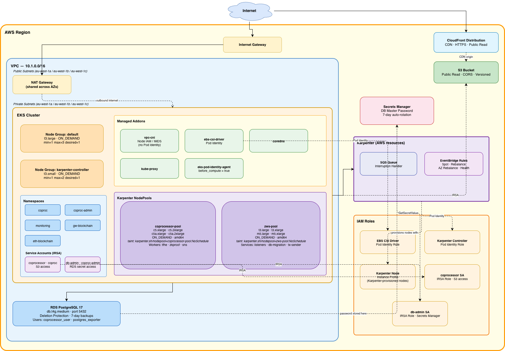

## Terraform-Coprocessor-Modules

This repo provides a Terraform Module for deploying the base layer infrastructure for the [Coprocessor](https://docs.zama.org/protocol/protocol/overview/coprocessor#what-is-the-coprocessor) of the [Zama Protocol](https://docs.zama.org/protocol/zama-protocol-litepaper).

---

## Architecture

Infrastructure deployed by the [`examples/testnet-complete`](./examples/testnet-complete) example.



---

## Requirements

| Requirement | Notes |
|-------------|-------|
| **AWS account** | IAM permissions to create VPC, EKS, RDS, S3, IAM, SQS, and EventBridge resources |
| **Terraform ≥ 1.11** | Required for write-only variables (`password_wo`) and S3 native state locking |
| **AWS CLI** | Configured with credentials for the target account (`aws configure` or env vars) |
| **kubectl** | For post-deployment cluster access (`aws eks update-kubeconfig ...`) |
| **S3 bucket for remote state** | Pre-created; referenced in the example `versions.tf` backend block |

---

## Usage

Two ready-to-deploy examples are provided. Each is a fully-formed, immediately deployable configuration — not a showcase of every available parameter, but a production-ready starting point that covers the standard Coprocessor deployment.

| Example | Use case |
|---------|----------|
| [`examples/testnet-complete`](./examples/testnet-complete) | Greenfield — creates VPC, EKS, RDS, and S3 from scratch |
| [`examples/testnet-existing-infra`](./examples/testnet-existing-infra) | Bring-your-own VPC and EKS — only deploys RDS and S3 |

For the full set of available inputs and their defaults, see the [Inputs](#inputs) table below or `terraform.tfvars.example` at the repo root.

**Steps:**

1. Copy the relevant example directory into your own infrastructure repository.
2. Update the `source` in `main.tf` to reference the remote versioned release: `git::https://github.com/zama-ai/terraform-coprocessor-modules.git?ref=<version>`
3. Replace every value marked `# CHANGE ME` in `terraform.tfvars` — primarily `partner_name`, `aws_region`, and any account-specific IDs.
4. Update the backend bucket/key/region in `versions.tf`.
5. All other values are pre-configured with sensible defaults and require no changes for a standard testnet deployment.

**Kubernetes provider authentication:**

When `eks.enabled = true` (`testnet-complete`), the Kubernetes and Helm providers are configured automatically using the EKS cluster outputs — no manual credential configuration is needed.

When `eks.enabled = false` (`testnet-existing-infra`), you must supply `kubernetes_provider` in `terraform.tfvars`:

```hcl
kubernetes_provider = {
  host                   = "https://<cluster-endpoint>"
  cluster_ca_certificate = "<base64-encoded-ca-cert>"
  cluster_name           = "<cluster-name>"
  oidc_provider_arn      = "arn:aws:iam::<account>:oidc-provider/<oidc-id>"
}
```

Retrieve these values from your existing cluster:

```bash
aws eks describe-cluster --name <cluster-name> --query 'cluster.{endpoint:endpoint,ca:certificateAuthority.data}'
aws eks describe-cluster --name <cluster-name> --query 'cluster.identity.oidc.issuer'
```

```bash
terraform init
terraform plan
terraform apply
```

---

## Tests

Uses the native [Terraform test framework](https://developer.hashicorp.com/terraform/language/testing) (requires Terraform ≥ 1.10). All tests use mock providers and `command = plan` — no real AWS credentials needed.

**Run all tests:**

```bash
terraform test                        # root module
cd modules/<name> && terraform test   # individual submodule
```

Tests live in `tests/unit.tftest.hcl` within each module directory.

---

## Pre-commit

This repo uses [pre-commit](https://pre-commit.com/) to enforce consistency on every commit.

**Dependencies** — must be on your `PATH`:

```bash
brew install pre-commit terraform-docs tflint
```

**Hooks that run automatically:**

| Hook | What it does |
|------|-------------|
| `terraform_fmt` | Formats all `.tf` files |
| `terraform_validate` | Validates module configuration |
| `terraform_tflint` | Lints for common mistakes and best practices |
| `terraform_docs` | Regenerates the `BEGIN_TF_DOCS` sections in all `README.md` files |
| `check-merge-conflict` | Blocks commits containing unresolved merge conflict markers |
| `end-of-file-fixer` | Ensures files end with a newline |
| `trailing-whitespace` | Removes trailing whitespace |

To run all hooks manually: `pre-commit run --all-files`

---

<!-- BEGIN_TF_DOCS -->
## Requirements

| Name | Version |
|------|---------|
| <a name="requirement_terraform"></a> [terraform](#requirement\_terraform) | >= 1.11 |
| <a name="requirement_aws"></a> [aws](#requirement\_aws) | ~> 6.0 |
| <a name="requirement_helm"></a> [helm](#requirement\_helm) | ~> 3.0 |
| <a name="requirement_kubernetes"></a> [kubernetes](#requirement\_kubernetes) | ~> 2.0 |
| <a name="requirement_random"></a> [random](#requirement\_random) | ~> 3.0 |

## Providers

No providers.

## Modules

| Name | Source | Version |
|------|--------|---------|
| <a name="module_eks"></a> [eks](#module\_eks) | ./modules/eks | n/a |
| <a name="module_k8s_coprocessor_deps"></a> [k8s\_coprocessor\_deps](#module\_k8s\_coprocessor\_deps) | ./modules/k8s-coprocessor-deps | n/a |
| <a name="module_k8s_system_charts"></a> [k8s\_system\_charts](#module\_k8s\_system\_charts) | ./modules/k8s-system-charts | n/a |
| <a name="module_networking"></a> [networking](#module\_networking) | ./modules/networking | n/a |
| <a name="module_rds"></a> [rds](#module\_rds) | ./modules/rds | n/a |
| <a name="module_s3"></a> [s3](#module\_s3) | ./modules/s3 | n/a |

## Resources

No resources.

## Inputs

| Name | Description | Type | Default | Required |
|------|-------------|------|---------|:--------:|
| <a name="input_aws_region"></a> [aws\_region](#input\_aws\_region) | AWS region where resources will be deployed. | `string` | n/a | yes |
| <a name="input_default_tags"></a> [default\_tags](#input\_default\_tags) | Tags to apply to all resources. | `map(string)` | `{}` | no |
| <a name="input_eks"></a> [eks](#input\_eks) | EKS cluster configuration. Set enabled = false to skip all EKS resources. | <pre>object({<br/>    enabled = optional(bool, false)<br/><br/>    cluster = optional(object({<br/>      # Naming<br/>      version       = optional(string, "1.35")<br/>      name_override = optional(string, null) # overrides computed "<name>-<env>" cluster name<br/><br/>      # Endpoint access<br/>      endpoint_public_access       = optional(bool, false)<br/>      endpoint_private_access      = optional(bool, true)<br/>      endpoint_public_access_cidrs = optional(list(string), [])<br/><br/>      # Auth<br/>      enable_irsa                      = optional(bool, true)<br/>      enable_creator_admin_permissions = optional(bool, true) # grants the Terraform caller admin access<br/>      admin_role_arns                  = optional(list(string), [])<br/>    }), {})<br/><br/>    addons = optional(object({<br/>      # Standard managed addons; each value is passed verbatim to the upstream eks module<br/>      defaults = optional(map(any), {<br/>        aws-ebs-csi-driver     = { most_recent = true }<br/>        coredns                = { most_recent = true }<br/>        vpc-cni                = { most_recent = true, before_compute = true }<br/>        kube-proxy             = { most_recent = true }<br/>        eks-pod-identity-agent = { most_recent = true, before_compute = true }<br/>      })<br/><br/>      # Additional addons merged on top of defaults<br/>      extra = optional(map(any), {})<br/><br/>      # VPC CNI environment tuning<br/>      vpc_cni_config = optional(object({<br/>        init = optional(object({<br/>          env = optional(object({<br/>            DISABLE_TCP_EARLY_DEMUX = optional(string, "true")<br/>          }), {})<br/>        }), {})<br/>        env = optional(object({<br/>          ENABLE_POD_ENI                    = optional(string, "true")<br/>          POD_SECURITY_GROUP_ENFORCING_MODE = optional(string, "standard")<br/>          ENABLE_PREFIX_DELEGATION          = optional(string, "true")<br/>          WARM_PREFIX_TARGET                = optional(string, "1")<br/>        }), {})<br/>      }), {})<br/>    }), {})<br/><br/>    node_groups = optional(object({<br/>      # Defaults merged into every node group (same schema as groups entries)<br/>      defaults = optional(map(any), {})<br/><br/>      # IAM policies attached to every node group's IAM role<br/>      default_iam_policies = optional(map(string), {<br/>        AmazonEBSCSIDriverPolicy           = "arn:aws:iam::aws:policy/service-role/AmazonEBSCSIDriverPolicy"<br/>        AmazonEC2ContainerRegistryReadOnly = "arn:aws:iam::aws:policy/AmazonEC2ContainerRegistryReadOnly"<br/>        AmazonEKSWorkerNodePolicy          = "arn:aws:iam::aws:policy/AmazonEKSWorkerNodePolicy"<br/>        AmazonEKS_CNI_Policy               = "arn:aws:iam::aws:policy/AmazonEKS_CNI_Policy"<br/>        AmazonSSMManagedInstanceCore       = "arn:aws:iam::aws:policy/AmazonSSMManagedInstanceCore"<br/>      })<br/><br/>      groups = optional(map(object({<br/>        # Capacity<br/>        capacity_type = optional(string, "ON_DEMAND") # "ON_DEMAND" | "SPOT"<br/>        min_size      = optional(number, 1)<br/>        max_size      = optional(number, 3)<br/>        desired_size  = optional(number, 1)<br/><br/>        # Instance<br/>        instance_types             = optional(list(string), ["t3.medium"])<br/>        ami_type                   = optional(string, "AL2023_x86_64_STANDARD")<br/>        use_custom_launch_template = optional(bool, true)<br/><br/>        # Storage<br/>        disk_size = optional(number, 30)<br/>        disk_type = optional(string, "gp3")<br/><br/>        # Scheduling<br/>        labels                 = optional(map(string), {})<br/>        tags                   = optional(map(string), {})<br/>        use_additional_subnets = optional(bool, false) # place group in additional_subnet_ids instead of private<br/>        taints = optional(map(object({<br/>          key    = string<br/>          value  = optional(string)<br/>          effect = string # "NO_SCHEDULE" | "NO_EXECUTE" | "PREFER_NO_SCHEDULE"<br/>        })), {})<br/><br/>        # Rolling updates (AWS requires exactly one of the two fields)<br/>        update_config = optional(object({<br/>          max_unavailable            = optional(number)<br/>          max_unavailable_percentage = optional(number)<br/>        }), { max_unavailable = 1 })<br/><br/>        # IAM<br/>        iam_role_additional_policies = optional(map(string), {})<br/><br/>        # Instance metadata (IMDSv2 enforced by default; hop limit 1 blocks non-hostNetwork pods)<br/>        metadata_options = optional(map(string), {<br/>          http_endpoint               = "enabled"<br/>          http_put_response_hop_limit = "1"<br/>          http_tokens                 = "required"<br/>        })<br/>      })), {})<br/>    }), {})<br/><br/>    karpenter = optional(object({<br/>      enabled = optional(bool, true)<br/><br/>      # Controller identity<br/>      namespace       = optional(string, "karpenter")<br/>      service_account = optional(string, "karpenter")<br/><br/>      # SQS / EventBridge naming (defaults to computed values when null)<br/>      queue_name       = optional(string, null)<br/>      rule_name_prefix = optional(string, null) # max 20 chars<br/><br/>      # Node IAM<br/>      create_spot_service_linked_role   = optional(bool, true)<br/>      node_iam_role_additional_policies = optional(map(string), {})<br/><br/>      # Dedicated node group for the Karpenter controller pod<br/>      controller_nodegroup = optional(object({<br/>        enabled        = optional(bool, true)<br/>        capacity_type  = optional(string, "ON_DEMAND")<br/>        min_size       = optional(number, 1)<br/>        max_size       = optional(number, 2)<br/>        desired_size   = optional(number, 1)<br/>        instance_types = optional(list(string), ["t3.small"])<br/>        ami_type       = optional(string, "AL2023_x86_64_STANDARD")<br/>        disk_size      = optional(number, 30)<br/>        disk_type      = optional(string, "gp3")<br/>        labels         = optional(map(string), { "karpenter.sh/controller" = "true" })<br/>        taints = optional(map(object({<br/>          key    = string<br/>          value  = optional(string)<br/>          effect = string<br/>          })), {<br/>          karpenter = {<br/>            key    = "karpenter.sh/controller"<br/>            value  = "true"<br/>            effect = "NO_SCHEDULE"<br/>          }<br/>        })<br/>      }), { enabled = true })<br/>    }), { enabled = false })<br/>  })</pre> | <pre>{<br/>  "enabled": false<br/>}</pre> | no |
| <a name="input_environment"></a> [environment](#input\_environment) | Deployment environment (e.g. testnet, mainnet). | `string` | n/a | yes |
| <a name="input_k8s_coprocessor_deps"></a> [k8s\_coprocessor\_deps](#input\_k8s\_coprocessor\_deps) | Kubernetes coprocessor resource configuration (namespaces, service accounts, storage classes, ExternalName services). | <pre>object({<br/>    enabled = optional(bool, false)<br/><br/>    default_namespace = optional(string, "coproc")<br/><br/>    # Namespaces<br/>    namespaces = optional(map(object({<br/>      enabled     = optional(bool, true)<br/>      labels      = optional(map(string), {})<br/>      annotations = optional(map(string), {})<br/>    })), {})<br/><br/>    # Service accounts — built-in toggles + custom extras.<br/>    service_accounts = optional(object({<br/>      # coprocessor: IRSA role with S3 access (s3:*Object + s3:ListBucket).<br/>      coprocessor = optional(object({<br/>        enabled       = optional(bool, true)<br/>        s3_bucket_key = optional(string, "coprocessor")<br/>      }), {})<br/><br/>      # db_admin: IRSA role with RDS master secret (GetSecretValue + DescribeSecret).<br/>      db_admin = optional(object({<br/>        enabled = optional(bool, true)<br/>      }), {})<br/><br/>      # Additional service accounts. An entry with the same key as a built-in overrides it.<br/>      extra = optional(map(object({<br/>        name                   = string<br/>        namespace              = optional(string, null)<br/>        iam_role_name_override = optional(string, null)<br/>        s3_bucket_access = optional(map(object({<br/>          actions = list(string)<br/>        })), {})<br/>        rds_master_secret_access = optional(bool, false)<br/>        iam_policy_statements = optional(list(object({<br/>          sid       = optional(string, "")<br/>          effect    = string<br/>          actions   = list(string)<br/>          resources = list(string)<br/>          conditions = optional(list(object({<br/>            test     = string<br/>            variable = string<br/>            values   = list(string)<br/>          })), [])<br/>        })), [])<br/>        labels      = optional(map(string), {})<br/>        annotations = optional(map(string), {})<br/>      })), {})<br/>    }), {})<br/><br/>    # Storage classes — built-in toggles + custom extras.<br/>    storage_classes = optional(object({<br/>      # gp3: encrypted EBS gp3, WaitForFirstConsumer, set as cluster default.<br/>      gp3 = optional(object({<br/>        enabled = optional(bool, true)<br/>      }), {})<br/><br/>      # Additional storage classes. An entry with the same key as a built-in overrides it.<br/>      extra = optional(map(object({<br/>        provisioner            = string<br/>        reclaim_policy         = optional(string, "Delete")<br/>        volume_binding_mode    = optional(string, "WaitForFirstConsumer")<br/>        allow_volume_expansion = optional(bool, true)<br/>        parameters             = optional(map(string), {})<br/>        annotations            = optional(map(string), {})<br/>        labels                 = optional(map(string), {})<br/>      })), {})<br/>    }), {})<br/><br/>    # ExternalName services — map key becomes the Service name.<br/>    # When endpoint is omitted the root module resolves it from the matching module output (see local.module_endpoints).<br/>    external_name_services = optional(map(object({<br/>      enabled     = optional(bool, true)<br/>      endpoint    = optional(string, null)<br/>      namespace   = optional(string, null)<br/>      annotations = optional(map(string), {})<br/>    })), {})<br/>  })</pre> | <pre>{<br/>  "enabled": false<br/>}</pre> | no |
| <a name="input_k8s_system_charts"></a> [k8s\_system\_charts](#input\_k8s\_system\_charts) | Kubernetes system-level applications to deploy via Helm. | <pre>object({<br/>    enabled = optional(bool, false)<br/><br/>    # Toggle built-in applications on/off. See modules/k8s-system-charts for full docs.<br/>    defaults = optional(object({<br/>      karpenter_nodepools = optional(object({<br/>        enabled = optional(bool, true)<br/>      }), {})<br/>      prometheus_operator_crds = optional(object({<br/>        enabled    = optional(bool, true)<br/>        repository = optional(string, "https://prometheus-community.github.io/helm-charts")<br/>        chart      = optional(string, "prometheus-operator-crds")<br/>        version    = optional(string, "28.0.1")<br/>      }), {})<br/>      metrics_server = optional(object({<br/>        enabled    = optional(bool, true)<br/>        repository = optional(string, "https://kubernetes-sigs.github.io/metrics-server")<br/>        chart      = optional(string, "metrics-server")<br/>        version    = optional(string, "3.13.0")<br/>        values     = optional(string, "")<br/>      }), {})<br/>      karpenter = optional(object({<br/>        enabled    = optional(bool, true)<br/>        repository = optional(string, "oci://public.ecr.aws/karpenter")<br/>        chart      = optional(string, "karpenter")<br/>        version    = optional(string, "1.8.2")<br/>        values     = optional(string, "")<br/>      }), {})<br/>      k8s_monitoring = optional(object({<br/>        enabled        = optional(bool, false)<br/>        repository     = optional(string, "https://grafana.github.io/helm-charts")<br/>        chart          = optional(string, "k8s-monitoring")<br/>        version        = optional(string, "4.0.1")<br/>        prometheus_url = optional(string, "")<br/>        loki_url       = optional(string, "")<br/>        otlp_url       = optional(string, "")<br/>        values         = optional(string, "")<br/>      }), {})<br/>      prometheus_rds_exporter = optional(object({<br/>        enabled    = optional(bool, false)<br/>        repository = optional(string, "oci://public.ecr.aws/qonto")<br/>        chart      = optional(string, "prometheus-rds-exporter-chart")<br/>        version    = optional(string, "0.16.0")<br/>      }), {})<br/>      prometheus_postgres_exporter = optional(object({<br/>        enabled    = optional(bool, false)<br/>        repository = optional(string, "https://prometheus-community.github.io/helm-charts")<br/>        chart      = optional(string, "prometheus-postgres-exporter")<br/>        version    = optional(string, "7.3.0")<br/>        values     = optional(string, "")<br/>      }), {})<br/>    }), {})<br/><br/>    # Additional custom applications. An entry with the same key as a built-in overrides it.<br/>    extra = optional(map(object({<br/>      namespace = object({<br/>        name   = string<br/>        create = optional(bool, false)<br/>      })<br/>      service_account = optional(object({<br/>        create      = optional(bool, false)<br/>        name        = optional(string, null)<br/>        labels      = optional(map(string), {})<br/>        annotations = optional(map(string), {})<br/>      }), null)<br/>      irsa = optional(object({<br/>        enabled   = optional(bool, false)<br/>        role_name = optional(string, null)<br/>        policy_statements = optional(list(object({<br/>          sid       = optional(string, "")<br/>          effect    = string<br/>          actions   = list(string)<br/>          resources = list(string)<br/>        })), [])<br/>      }), { enabled = false })<br/>      helm_chart = optional(object({<br/>        enabled          = optional(bool, true)<br/>        repository       = string<br/>        chart            = string<br/>        version          = string<br/>        values           = optional(string, "")<br/>        set              = optional(map(string), {})<br/>        crd_chart        = optional(bool, false)<br/>        create_namespace = optional(bool, false)<br/>        atomic           = optional(bool, true)<br/>        wait             = optional(bool, true)<br/>        timeout          = optional(number, 300)<br/>      }), null)<br/>      additional_manifests = optional(object({<br/>        enabled   = optional(bool, false)<br/>        manifests = optional(map(string), {})<br/>      }), { enabled = false })<br/>    })), {})<br/>  })</pre> | <pre>{<br/>  "enabled": false<br/>}</pre> | no |
| <a name="input_kubernetes_provider"></a> [kubernetes\_provider](#input\_kubernetes\_provider) | Kubernetes provider configuration. When eks.enabled = true these are resolved automatically from the EKS module. Set explicitly when bringing your own cluster. | <pre>object({<br/>    host                   = optional(string, null)<br/>    cluster_ca_certificate = optional(string, null)<br/>    cluster_name           = optional(string, null)<br/>    oidc_provider_arn      = optional(string, null)<br/>  })</pre> | `{}` | no |
| <a name="input_networking"></a> [networking](#input\_networking) | VPC and subnet configuration. Set enabled = false to skip all networking resources. | <pre>object({<br/>    enabled = optional(bool, false)<br/><br/>    vpc = optional(object({<br/>      # Base<br/>      cidr               = string<br/>      availability_zones = optional(list(string), []) # leave empty to auto-discover AZs<br/>      single_nat_gateway = optional(bool, false)      # true = one NAT GW shared across AZs (cheaper, less resilient)<br/><br/>      # Subnet CIDR calculation<br/>      private_subnet_cidr_mask = optional(number, 20)<br/>      public_subnet_cidr_mask  = optional(number, 20)<br/><br/>      # Flow logs<br/>      flow_log_enabled         = optional(bool, false)<br/>      flow_log_destination_arn = optional(string, null)<br/>    }), null)<br/><br/>    additional_subnets = optional(object({<br/>      enabled   = optional(bool, false)<br/>      cidr_mask = optional(number, 20)<br/><br/>      # EKS integration<br/>      expose_for_eks = optional(bool, false)  # add karpenter.sh/discovery tag<br/>      elb_role       = optional(string, null) # "internal" | "public" | null<br/>      tags           = optional(map(string), {})<br/>      node_groups    = optional(list(string), [])<br/>    }), { enabled = false })<br/><br/>    # For usage of an existing VPC (bypasses networking module for RDS)<br/>    existing_vpc = optional(object({<br/>      vpc_id                     = string<br/>      private_subnet_ids         = list(string)<br/>      private_subnet_cidr_blocks = list(string)<br/>    }))<br/>  })</pre> | n/a | yes |
| <a name="input_partner_name"></a> [partner\_name](#input\_partner\_name) | Partner identifier — used as a name prefix across all resources. | `string` | n/a | yes |
| <a name="input_rds"></a> [rds](#input\_rds) | RDS instance configuration. Set enabled = false to skip. | <pre>object({<br/>    enabled = optional(bool, false)<br/><br/>    # Naming<br/>    db_name             = optional(string, null)<br/>    identifier_override = optional(string, null)<br/><br/>    # Engine<br/>    engine         = optional(string, "postgres")<br/>    engine_version = optional(string, "17")<br/><br/>    # Instance<br/>    instance_class        = optional(string, "db.m5.4xlarge")<br/>    allocated_storage     = optional(number, 400)<br/>    max_allocated_storage = optional(number, 1000)<br/>    multi_az              = optional(bool, false)<br/>    port                  = optional(number, 5432)<br/><br/>    # Credentials<br/>    username                            = optional(string, "postgres")<br/>    manage_master_user_password         = optional(bool, true)   # true = Secrets Manager managed (recommended)<br/>    password_wo                         = optional(string, null) # write-only; only used when manage_master_user_password = false<br/>    password_wo_version                 = optional(number, 1)    # increment to rotate a non-managed password<br/>    enable_master_password_rotation     = optional(bool, true)<br/>    master_password_rotation_days       = optional(number, 7)<br/>    iam_database_authentication_enabled = optional(bool, true)<br/><br/>    # Maintenance & backups<br/>    maintenance_window      = optional(string, "Mon:00:00-Mon:03:00")<br/>    backup_retention_period = optional(number, 30)<br/>    deletion_protection     = optional(bool, true)<br/><br/>    # Monitoring<br/>    monitoring_interval          = optional(number, 60)<br/>    create_monitoring_role       = optional(bool, true)<br/>    monitoring_role_name         = optional(string, null)<br/>    existing_monitoring_role_arn = optional(string, null)<br/><br/>    # Parameters<br/>    parameters = optional(list(object({<br/>      name  = string<br/>      value = string<br/>    })), [])<br/><br/>    # Security group<br/>    additional_allowed_cidr_blocks = optional(list(string), [])<br/>  })</pre> | <pre>{<br/>  "enabled": true<br/>}</pre> | no |
| <a name="input_s3"></a> [s3](#input\_s3) | S3 configuration.<br/><br/>- buckets: Map of S3 buckets to create.<br/>  The map key is a short logical name (e.g. "coprocessor", "raw-data").<br/>  Each entry defines configuration and behavior for that bucket. | <pre>object({<br/>    buckets = map(object({<br/>      # Human-readable description (used for tagging)<br/>      purpose = string<br/><br/>      # Override the computed bucket name (use when importing a pre-existing bucket)<br/>      name_override = optional(string, null)<br/><br/>      # Allow deletion even if objects exist<br/>      force_destroy = optional(bool, false)<br/><br/>      # Enable object versioning<br/>      versioning = optional(bool, true)<br/><br/>      # Public access configuration<br/>      public_access = optional(object({<br/>        enabled = bool<br/>        }), {<br/>        enabled = false<br/>      })<br/><br/>      # CORS configuration<br/>      cors = optional(object({<br/>        enabled         = bool<br/>        allowed_origins = list(string)<br/>        allowed_methods = list(string)<br/>        allowed_headers = list(string)<br/>        expose_headers  = list(string)<br/>        }), {<br/>        enabled         = false<br/>        allowed_origins = []<br/>        allowed_methods = []<br/>        allowed_headers = []<br/>        expose_headers  = []<br/>      })<br/><br/>      # CloudFront distribution<br/>      cloudfront = optional(object({<br/>        enabled                   = optional(bool, false)<br/>        price_class               = optional(string, "PriceClass_All")<br/>        compress                  = optional(bool, true)<br/>        viewer_protocol_policy    = optional(string, "redirect-to-https")<br/>        allowed_methods           = optional(list(string), ["GET", "HEAD"])<br/>        cached_methods            = optional(list(string), ["GET", "HEAD"])<br/>        cache_policy_id           = optional(string, "658327ea-f89d-4fab-a63d-7e88639e58f6") # AWS managed CachingOptimized<br/>        geo_restriction_type      = optional(string, "none")<br/>        geo_restriction_locations = optional(list(string), [])<br/>        aliases                   = optional(list(string), [])       # custom hostnames (CNAMEs) for the distribution; requires acm_certificate_arn<br/>        acm_certificate_arn       = optional(string, null)           # if set, used instead of default CloudFront certificate<br/>        ssl_support_method        = optional(string, "sni-only")     # only relevant when acm_certificate_arn is set<br/>        minimum_protocol_version  = optional(string, "TLSv1.2_2021") # only relevant when acm_certificate_arn is set<br/>      }), { enabled = false })<br/><br/>      # Bucket policies<br/>      policy_statements = optional(list(object({<br/>        sid        = string<br/>        effect     = string<br/>        principals = map(list(string))<br/>        actions    = list(string)<br/>        resources  = list(string)<br/>        conditions = optional(list(object({<br/>          test     = string<br/>          variable = string<br/>          values   = list(string)<br/>        })), [])<br/>      })), [])<br/>    }))<br/>  })</pre> | <pre>{<br/>  "buckets": {}<br/>}</pre> | no |

## Outputs

| Name | Description |
|------|-------------|
| <a name="output_additional_subnet_ids"></a> [additional\_subnet\_ids](#output\_additional\_subnet\_ids) | List of additional subnet IDs. |
| <a name="output_eks_cluster_certificate_authority_data"></a> [eks\_cluster\_certificate\_authority\_data](#output\_eks\_cluster\_certificate\_authority\_data) | Base64-encoded certificate authority data for the EKS cluster. |
| <a name="output_eks_cluster_endpoint"></a> [eks\_cluster\_endpoint](#output\_eks\_cluster\_endpoint) | The EKS cluster API endpoint. |
| <a name="output_eks_cluster_name"></a> [eks\_cluster\_name](#output\_eks\_cluster\_name) | The EKS cluster name. |
| <a name="output_eks_karpenter_iam_role_arn"></a> [eks\_karpenter\_iam\_role\_arn](#output\_eks\_karpenter\_iam\_role\_arn) | IAM role ARN for the Karpenter controller. |
| <a name="output_eks_karpenter_node_iam_role_arn"></a> [eks\_karpenter\_node\_iam\_role\_arn](#output\_eks\_karpenter\_node\_iam\_role\_arn) | IAM role ARN for Karpenter-managed nodes. |
| <a name="output_eks_karpenter_queue_name"></a> [eks\_karpenter\_queue\_name](#output\_eks\_karpenter\_queue\_name) | SQS queue name for Karpenter interruption handling. |
| <a name="output_eks_oidc_provider_arn"></a> [eks\_oidc\_provider\_arn](#output\_eks\_oidc\_provider\_arn) | The ARN of the OIDC provider for IRSA. |
| <a name="output_private_subnet_ids"></a> [private\_subnet\_ids](#output\_private\_subnet\_ids) | List of private subnet IDs. |
| <a name="output_rds_db_instance_address"></a> [rds\_db\_instance\_address](#output\_rds\_db\_instance\_address) | The RDS instance hostname (without port). |
| <a name="output_rds_db_instance_arn"></a> [rds\_db\_instance\_arn](#output\_rds\_db\_instance\_arn) | The ARN of the RDS instance. |
| <a name="output_rds_db_instance_endpoint"></a> [rds\_db\_instance\_endpoint](#output\_rds\_db\_instance\_endpoint) | The RDS instance connection endpoint (host:port). |
| <a name="output_rds_db_instance_identifier"></a> [rds\_db\_instance\_identifier](#output\_rds\_db\_instance\_identifier) | The identifier of the RDS instance. |
| <a name="output_rds_db_instance_port"></a> [rds\_db\_instance\_port](#output\_rds\_db\_instance\_port) | The port the RDS instance is listening on. |
| <a name="output_rds_master_secret_arn"></a> [rds\_master\_secret\_arn](#output\_rds\_master\_secret\_arn) | ARN of the Secrets Manager secret containing the RDS master user password. Null when manage\_master\_user\_password = false or rds.enabled = false. |
| <a name="output_rds_security_group_id"></a> [rds\_security\_group\_id](#output\_rds\_security\_group\_id) | The ID of the RDS security group. |
| <a name="output_s3_bucket_arns"></a> [s3\_bucket\_arns](#output\_s3\_bucket\_arns) | Map of logical bucket key to bucket ARN. |
| <a name="output_s3_bucket_names"></a> [s3\_bucket\_names](#output\_s3\_bucket\_names) | Map of logical bucket key to bucket name. |
| <a name="output_s3_cloudfront_distribution_ids"></a> [s3\_cloudfront\_distribution\_ids](#output\_s3\_cloudfront\_distribution\_ids) | Map of logical bucket key to CloudFront distribution ID. |
| <a name="output_s3_cloudfront_domain_names"></a> [s3\_cloudfront\_domain\_names](#output\_s3\_cloudfront\_domain\_names) | Map of logical bucket key to CloudFront distribution domain name. |
| <a name="output_vpc_id"></a> [vpc\_id](#output\_vpc\_id) | The ID of the VPC. |
<!-- END_TF_DOCS -->
